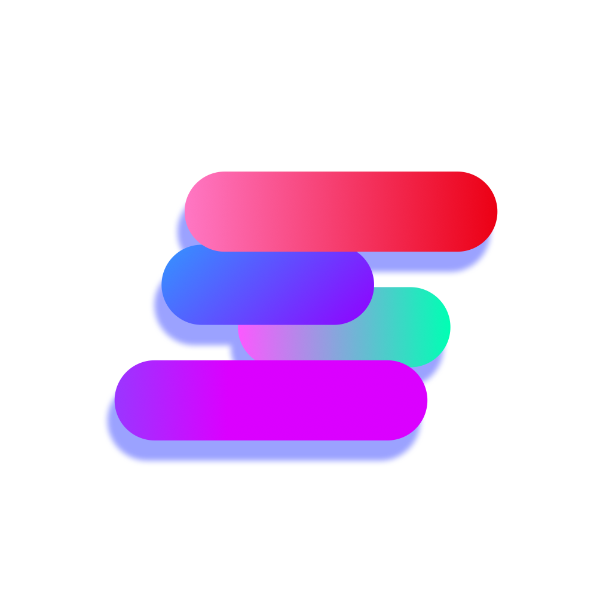

<!-- Header -->

 

### Vibe Coding Developer · CEO

**Turning ideas into products.**

 

 

## About

Hi, I'm **Antonio**.

I'm a **Vibe Coding Developer** focused on turning ideas into real products through rapid prototyping, experimentation, and practical development.

I also lead **Sojak Studio**, working across technology, operations, and product development.

> **Build fast. Learn continuously. Make ideas real.**

 

## Roles

**Sojak Studio**

- Chief Executive Officer
- Head of MS Management Support Office

 

## Tech

  

`Vue` · `React` · `Node.js` · `Docker` · `Rocky Linux`

 

## Sojak Studio

  

**Technology, products, and ideas — built into reality.**

 

 

## Contact

For business, collaboration, or support inquiries:

<table>
<tr>
<td><b>Business & Support</b></td>
<td><a href="mailto:support@sojak.io">support@sojak.io</a></td>
</tr>
<tr>
<td><b>Direct Contact</b></td>
<td><a href="mailto:antonio@sojak.io">antonio@sojak.io</a></td>
</tr>
<tr>
<td><b>Website</b></td>
<td><a href="https://sojak.io">sojak.io</a></td>
</tr>
</table>

 

## GitHub

  

 

---

Building at the intersection of ideas, technology, and execution.

  

**Antonio · Sojak Studio**

